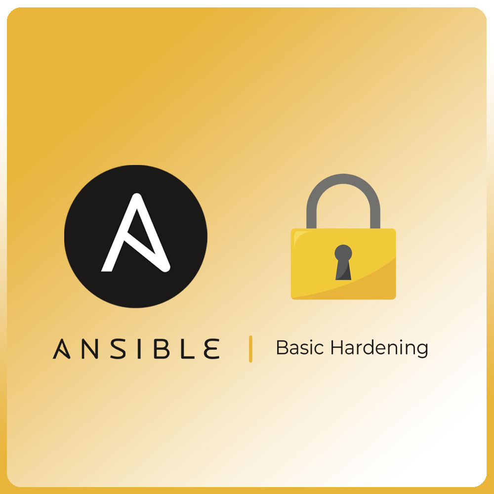

# Ansible Role: Basic Server Hardening

[](https://galaxy.ansible.com/ui/standalone/roles/rletourneur-devops-store/basic-server-hardening)
[](https://devops.store)

> **💡 Are you using this role in production ?**
> This project is maintained for free by **DevOps Store**.
> Support our work (and save time) by discovering our certified Premium modules:
> 👉 **[See our High Availability modules (Keycloak, Postgres...)](https://devops.store/boutique)**

<p align="center">
  
</p>

## 1. Summary

The `basic_server_hardening` Ansible role applies essential security hardening best practices for **Debian 12/13** and **Ubuntu 22.04/24.04** servers.

This role automates the essential security configuration that every server should have: secure SSH, active firewall, Fail2Ban protection, and automatic security patch updates.

## 2. Key Features

* **SSH Hardening**: Disable root login, SSH key authentication only, configurable port
* **UFW Firewall**: Simplified configuration to open only necessary ports (22, 80, 443)
* **Fail2Ban**: Automatic protection against SSH brute force attacks
* **Auto-Upgrades**: Automatic installation of security patches via unattended-upgrades
* **Multi-OS Compatibility**: Debian 12/13, Ubuntu 22.04/24.04 LTS
* **Idempotent**: Can be run multiple times without side effects

## 3. Prerequisites

* **Operating System**: Debian 12/13 or Ubuntu 22.04/24.04 LTS
* **Ansible**: Version 2.14 or higher
* **Ansible Collections**: `community.general` (for UFW module)
* **Privileges**: The playbook must be executed with `become: true`
* **SSH Access**: You must have working SSH access with public key before running this role

> [!WARNING]
> **Risk of losing SSH access**: This role modifies SSH configuration and may prevent you from connecting if misconfigured. Make sure you have configured SSH key authentication before applying this role.

## 4. Configuration Variables

### SSH Variables

| Variable | Default | Description |
|----------|---------|-------------|
| `ssh_hardening_port` | `22` | SSH port (change to reduce automated attacks) |
| `ssh_hardening_disable_root_login` | `true` | Disable root login |
| `ssh_hardening_password_authentication` | `false` | Allow password authentication |
| `ssh_hardening_allowed_users` | `[]` | List of allowed users |
| `ssh_hardening_allowed_groups` | `[]` | List of allowed groups |
| `ssh_hardening_max_auth_tries` | `3` | Maximum authentication attempts |

### Firewall Variables

| Variable | Default | Description |
|----------|---------|-------------|
| `firewall_enabled` | `true` | Enable/disable UFW |
| `firewall_default_incoming` | `deny` | Default policy for incoming traffic |
| `firewall_default_outgoing` | `allow` | Default policy for outgoing traffic |
| `firewall_allowed_ports` | See defaults | List of ports to open |

### Fail2Ban Variables

| Variable | Default | Description |
|----------|---------|-------------|
| `fail2ban_enabled` | `true` | Enable/disable Fail2Ban |
| `fail2ban_ssh_maxretry` | `5` | Number of attempts before ban |
| `fail2ban_ssh_bantime` | `3600` | Ban duration (in seconds) |
| `fail2ban_ssh_findtime` | `600` | Time window to detect attempts |
| `fail2ban_ignoreip` | `["127.0.0.1/8", "::1"]` | IPs to ignore |

### Auto-Upgrades Variables

| Variable | Default | Description |
|----------|---------|-------------|
| `auto_upgrades_enabled` | `true` | Enable/disable auto-upgrades |
| `auto_upgrades_automatic_reboot` | `false` | Auto reboot if required |
| `auto_upgrades_automatic_reboot_time` | `"02:00"` | Auto reboot time |
| `auto_upgrades_mail` | `""` | Email for notifications |

## 5. Playbook Example

### Basic Playbook

```yaml
---
- hosts: servers
  become: true
  
  roles:
    - role: devops_store.basic_server_hardening
```

### Playbook with Custom Configuration

```yaml
---
- hosts: servers
  become: true
  
  vars:
    # Change SSH port
    ssh_hardening_port: 2222
    
    # Allow only specific users
    ssh_hardening_allowed_users:
      - admin
      - deploy
    
    # OpenAdditional ports
    firewall_allowed_ports:
      - port: 2222  # Custom SSH
        proto: tcp
        comment: "SSH Custom Port"
      - port: 80
        proto: tcp
        comment: "HTTP"
      - port: 443
        proto: tcp
        comment: "HTTPS"
      - port: 3306
        proto: tcp
        comment: "MySQL"
    
    # Fail2Ban configuration
    fail2ban_ssh_port: 2222
    fail2ban_ssh_maxretry: 3
    fail2ban_ssh_bantime: 7200  # 2 hours
    fail2ban_destemail: admin@example.com
    
    # Auto-upgrades with reboot
    auto_upgrades_automatic_reboot: true
    auto_upgrades_automatic_reboot_time: "03:00"
    auto_upgrades_mail: admin@example.com

  roles:
    - role: devops_store.basic_server_hardening
```

### Inventory Example

```ini
[servers]
web-01 ansible_host=192.168.1.10
web-02 ansible_host=192.168.1.11
db-01 ansible_host=192.168.1.20

[servers:vars]
ansible_user=ubuntu
ansible_ssh_private_key_file=~/.ssh/id_rsa
```

## 6. Running the Playbook

### Install Required Collection

```bash
ansible-galaxy collection install community.general
```

### Execution

```bash
ansible-playbook -i your_inventory your_playbook.yml
```

### Partial Execution with Tags

```bash
# Apply only SSH hardening
ansible-playbook -i inventory playbook.yml --tags ssh

# Apply only firewall
ansible-playbook -i inventory playbook.yml --tags firewall

# Apply SSH and Fail2Ban
ansible-playbook -i inventory playbook.yml --tags ssh,fail2ban
```

## 7. Post-Deployment Verification

After running the role, verify everything works:

```bash
# Check SSH (from server)
sudo systemctl status ssh
sudo sshd -t

# Check UFW
sudo ufw status verbose

# Check Fail2Ban
sudo fail2ban-client status
sudo fail2ban-client status sshd

# Check auto-upgrades
sudo unattended-upgrade --dry-run
```

## 8. Important Notes

> [!IMPORTANT]
> **Before applying this role in production**:
> 1. Test on a development server or VM
> 2. Make sure you have an SSH key configured and tested
> 3. If you change the SSH port, update your local `~/.ssh/config`
> 4. Keep an SSH session open while applying the role

> [!CAUTION]
> **SSH Port Change**: If you change the SSH port, you will need to:
> - Update `fail2ban_ssh_port` to match
> - Update your local SSH configuration
> - Open the new port in the firewall (managed automatically by this role)

## 9. Troubleshooting

### I can no longer connect via SSH

1. Verify that you have configured your SSH key
2. If you changed the port, use `ssh -p <new_port> user@host`
3. Verify that the firewall allows the SSH port
4. As a last resort, use your hosting provider's console to fix `/etc/ssh/sshd_config`

### UFW is blocking all traffic

```bash
# Temporarily disable UFW (via hosting provider console)
sudo ufw disable

# Check and fix rules
sudo ufw status numbered
sudo ufw allow 22/tcp
sudo ufw enable
```

### Fail2Ban is banning me

```bash
# Unban an IP
sudo fail2ban-client set sshd unbanip <your_ip>

# Add your IP to ignored IPs in the playbook
fail2ban_ignoreip:
  - "127.0.0.1/8"
  - "::1"
  - "<your_ip>/32"
```

## 10. Operational Documentation

Detailed documentation is available in the `docs/` folder:

| Document | Description |
|----------|-------------|
| [`docs/day1-guide.md`](docs/day1-guide.md) | **Day 1 Guide**: Post-deployment checks, tests, health checklist |
| [`docs/day2-runbook.md`](docs/day2-runbook.md) | **Day 2+ Runbook**: SSH user management, port changes, Fail2Ban unlocking, troubleshooting |

## 11. Available Tags

| Tag | Description |
|-----|-------------|
| `ssh` | Apply only SSH hardening |
| `hardening` | Alias for SSH hardening |
| `firewall` | Configure only UFW |
| `ufw` | Alias for firewall |
| `fail2ban` | Configure only Fail2Ban |
| `security` | Alias for Fail2Ban |
| `auto-upgrades` | Configure only auto-upgrades |
| `updates` | Alias for auto-upgrades |
